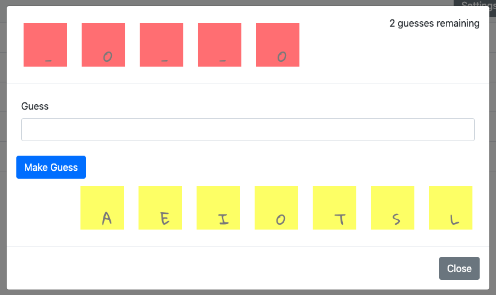

# Hangman

This Node.js application allows users to play customizable games of a fresh version of the timeless "Hangman". Users can tailor each game by font, colors, and difficulty.

## Installation

To install Hangman, simply type `npm install` at the command line.

## Usage

You can launch Hangman by typing `npm start` at the command line. With the application running, go to http://localhost:3000/ in your web browser to get started.

### Gameplay

New games can be created with the "New Game" button at the top-right of the page.

Created games are shown in the application's table. Each row dispays the respective game's difficulty, currently-revealed phrase, amount of remaining guesses, solution (if the game is completed), and current status. To resume a game left in-progress or view a completed one, simply click on its row in the table.

The game view looks like the following:

The top row of tiles shows the current view of the game's solution. Missing letters are represented with underscores. To the right of the tiles, you can see how many guesses you have left until game over. Next is the form to type and submit your next guess of a letter. You will find tiles of each of your previous guesses right below the "Make Guess" button.

### Settings

The app provides a few settings for you to customize each word game to your liking. First, you can choose between a handful of different fonts for each game's letter tiles. Next, you can change the color of that font, along with the backgrounds of both the solution and guess tiles. At the bottom, you can select between easy, medium, and hard difficulty. These options affect both the length of the solution word and the amount of guesses you are allowed.

## Built With

- [Node.js](https://nodejs.org/en/)
- [Express.js](https://expressjs.com/)
- [jQuery](https://jquery.com)
- [Bootstrap](https://getbootstrap.com)
